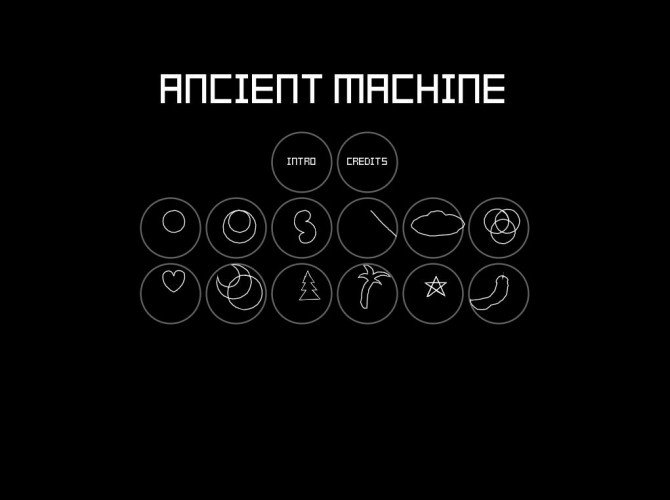

# AncientMachine
Ludum Dare 36: Ancient Technology.
Made by me and my friend Jakob. This is our first gamejam. 

Link to entry: http://ludumdare.com/compo/ludum-dare-36/?action=preview&uid=113447.

## Screenshots

  
   
  

## Download instructions
If you can't use the download link at the jam-entry, then you can run the game by first installing love2d. To do this go to https://love2d.org/ and download the love application. Then drag and drop this repository onto the application you just downloaded. 

## Controls
Use the mouse to select a point to spin around using A/D or Left/Right.
